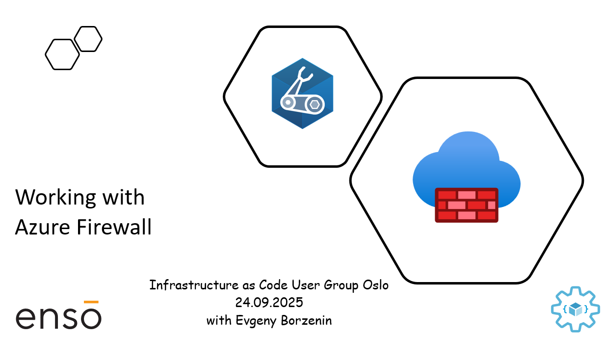

# Working with Azure Firewall

This is level 200 workshop that covers different aspects of working with [Azure Firewall](https://learn.microsoft.com/en-us/azure/firewall/overview) where you will learn:

- What is Azure Firewall
- What are the common use cases for Azure Firewall
- How to deploy and configure Azure Firewall with hub-and-spoke architecture
- How Azure Firewall policies are structured
- How to create and manage Network and Application rules
- What is SNAT port exhaustion and how to mitigate it
- How to monitor Azure Firewall with logs and metrics

and much more...

Workshop is organized as a combination of theoretical blocks with slides and hand-on labs. Estimated time for workshop completion is between 3 and 4 hours.

## Agenda

- Welcome + practical information
- Azure Firewall overview (slides)
- [Lab-01](labs/lab-01/index.md) - Provision lab resources
- [Lab-07](labs/lab-07/index.md) - Cleaning up resources

## Prerequisites

Please spend some time before the workshop and make sure that you have installed/registered/configured all [prerequisites](./prerequisites.md).