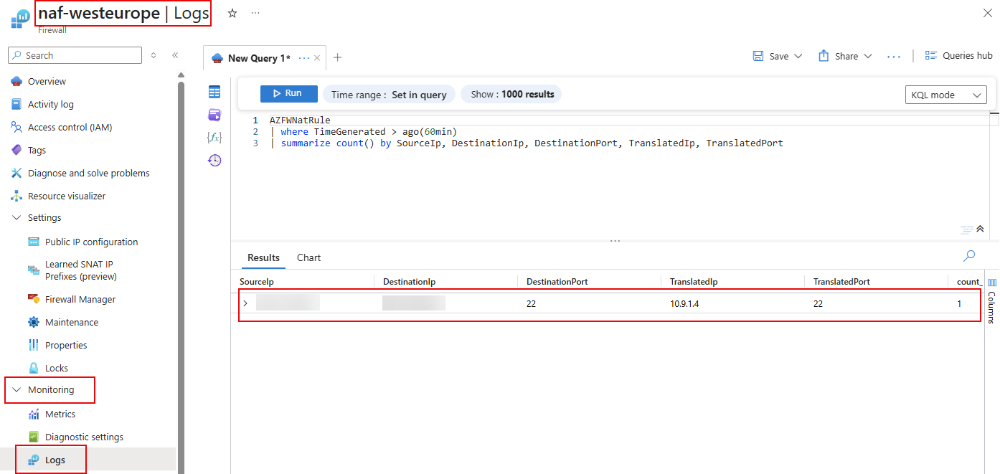

# lab-05 - Filter inbound Internet traffic with Azure Firewall DNAT rules


Create new file `inbound-dnat-rules.bicep` with the following content:

```bicep
param parLocation string = 'westeurope'
param parYourHomeIP string
param parFirewallPublicIP string

resource firewallPolicies 'Microsoft.Network/firewallPolicies@2024-07-01' existing = {
  name: 'nfp-${parLocation}'
}

resource spokesRuleCollectionGroup 'Microsoft.Network/firewallPolicies/ruleCollectionGroups@2023-05-01' = {
  parent: firewallPolicies
  name: 'SpokesFirewallRuleCollectionGroup'
  properties: {
    priority: 100
    ruleCollections: [
      {
        name: 'spokes-nat-rc01'
        ruleCollectionType: 'FirewallPolicyNatRuleCollection'
        priority: 100
        action: {
          type: 'DNAT'
        }
        rules: [
        {
            name: 'allow-ssh-to-spoke1vm'
            ruleType: 'NatRule'
            translatedAddress: '10.9.1.4'
            translatedPort: '22'
            ipProtocols: [
              'TCP'
            ]
            sourceAddresses: [
              parYourHomeIP 
            ]
            sourceIpGroups: []
            destinationAddresses: [
              parFirewallPublicIP 
            ]
            destinationPorts: [
              '22'
            ]
          }       
        ]
      }                      
    ]
  }
}
```

Deploy it using `az cli`:

```powershell
# get your home ip from https://ifconfig.me/
$yourHomeIP = (curl -s ifconfig.me)

# get firewall Public IP
$firewallPublicIP = (az network public-ip show --resource-group rg-westeurope-azfw-labs --name pip-naf-westeurope --query ipAddress --output tsv)

# deploy inbound-dnat-rules.bicep
az deployment group create --resource-group rg-westeurope-azfw-labs --template-file inbound-dnat-rules.bicep --parameters parYourHomeIP=$yourHomeIP --parameters parFirewallPublicIP=$firewallPublicIP
```


```kusto
AZFWNatRule
| where TimeGenerated > ago(60min)
| summarize count() by SourceIp, DestinationIp, DestinationPort, TranslatedIp, TranslatedPort, Protocol, Action
```

